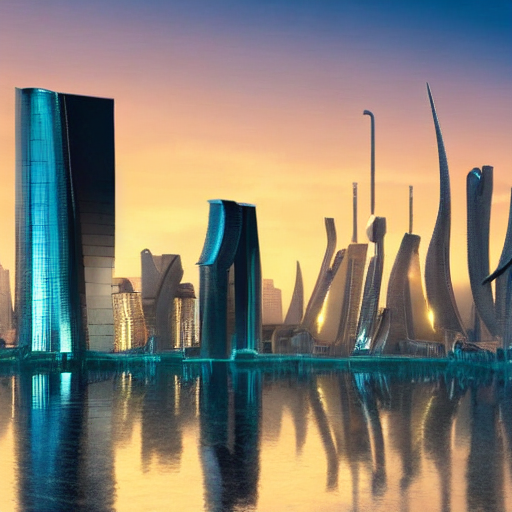

# AI-Powered Image Generator

A local, open-source text-to-image generation system built with **Python**, **Streamlit**, and **Hugging Face Diffusers**. This application allows users to generate high-quality images from text prompts using Stable Diffusion.

## 🚀 Features

- **Text-to-Image Generation**: Convert text prompts into images using Stable Diffusion v1.5 (default).
- **Adjustable Parameters**: Control generation with settings for:
  - Number of images
  - Inference steps (quality vs. speed)
  - Guidance Scale (CFG) - how closely to follow the prompt
  - Image dimensions (Height/Width)
- **Negative Prompts**: Filter out unwanted elements (e.g., "blurry", "distorted").
- **Local Execution**: Runs entirely on your machine (GPU preferred, CPU fallback available).
- **Gallery & Download**: View generated images and download them instantly.
- **Metadata Storage**: Automatically saves images with their generation parameters (JSON) for reproducibility.

## 🖼️ Sample Outputs

Here are some examples of images generated by the system:

### 1. Futuristic City
**Prompt:** *"A futuristic city at sunset..."*




## 🛠️ Technology Stack

- **Language**: Python 3.8+
- **UI Framework**: Streamlit
- **ML Library**: PyTorch, Diffusers, Transformers
- **Model**: `runwayml/stable-diffusion-v1-5` (Configurable)

## 📋 Requirements

### Hardware
- **GPU (Recommended)**: NVIDIA GPU with at least 4GB VRAM (8GB+ recommended for faster generation).
- **CPU**: Supported, but generation will be significantly slower (minutes vs. seconds).
- **RAM**: 8GB+ (16GB+ recommended).
- **Storage**: ~10GB free space for model weights and dependencies.

### Software
- Python 3.8 or higher
- CUDA Toolkit (if using NVIDIA GPU)

## ⚙️ Installation

1.  **Clone the Repository**
    ```bash
    git clone <repository-url>
    cd <repository-folder>
    ```

2.  **Create a Virtual Environment**
    ```bash
    python -m venv venv
    # Windows
    venv\Scripts\activate
    # Linux/Mac
    source venv/bin/activate
    ```

3.  **Install Dependencies**
    ```bash
    pip install -r requirements.txt
    ```
    *Note: If you have a specific CUDA version, you may need to install PyTorch manually first. Visit [pytorch.org](https://pytorch.org/get-started/locally/) for instructions.*

## 🏃‍♂️ Usage

1.  **Run the Application**
    ```bash
    streamlit run app.py
    ```

2.  **Generate Images**
    - Open your browser (usually `http://localhost:8501`).
    - Enter a text prompt (e.g., *"A cyberpunk city at night, neon lights, highly detailed"*).
    - Adjust settings in the sidebar if desired.
    - Click **Generate Images**.

3.  **View & Save**
    - Generated images will appear in the main view.
    - Click the **Download** button to save specific images.
    - All images and their metadata are also automatically saved in the `generated_images/` folder.

## 📝 Prompt Engineering Tips

- **Be Specific**: Instead of "a dog", try "a golden retriever running in a park, sunny day, 4k, photorealistic".
- **Use Style Descriptors**: Add terms like "oil painting", "digital art", "cinematic lighting", "concept art".
- **Negative Prompts**: Use this to remove artifacts. Common negative prompts: *blurry, low quality, extra limbs, distorted face, text, watermark*.

## ⚠️ Limitations & Future Improvements

- **Memory**: High resolution (1024x1024) requires significant VRAM.
- **Speed**: CPU generation is slow.
- **Future**:
    - Add support for Stable Diffusion XL (SDXL).
    - Implement Image-to-Image generation.
    - Add a history gallery to browse past generations.

## 🤝 Ethical Use

This tool uses powerful generative AI models. Please use it responsibly:
- Do not generate harmful, offensive, or illegal content.
- Respect copyright and intellectual property rights.
- Generated images contain an invisible watermark (from the Diffusers library) to indicate AI origin where supported.

---
**Talrn Remote ML Internship Task Assessment**
